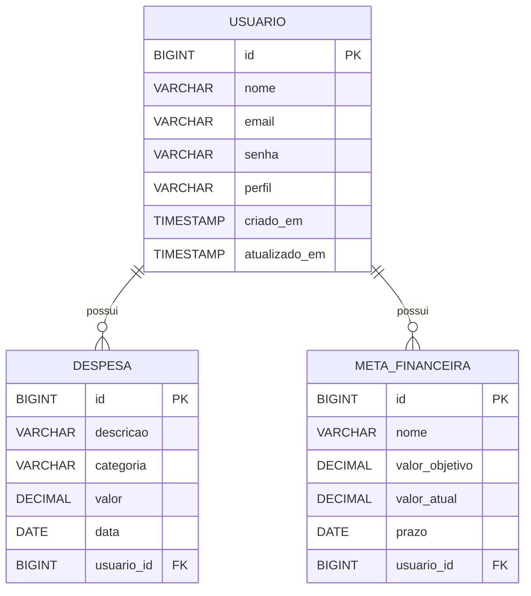
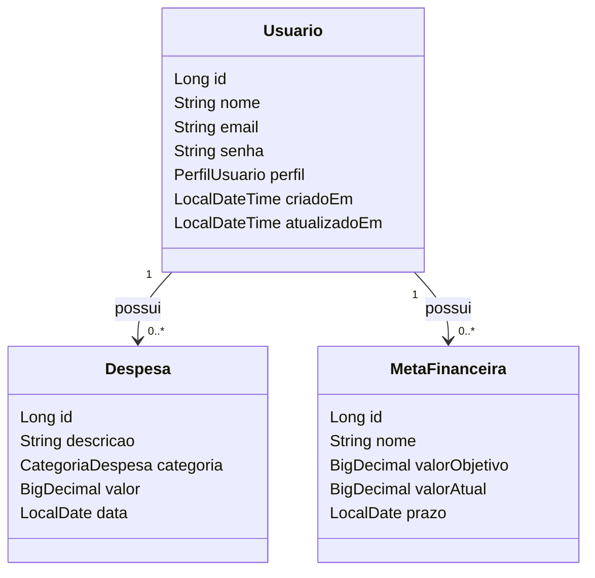

# Diagramas – FinClass API

Abaixo estão versões em **Mermaid**, que podem ser exportadas para imagens (PNG/SVG) usando ferramentas online,
atendendo ao requisito de entregar diagramas em imagem.

---

## Diagrama Entidade–Relacionamento (DER)



---

## Diagrama de Classes (Entidades)



---

## Visão de Arquitetura (Camadas)

```mermaid
graph TD
    A[Cliente Mobile / APEX] --> B[Controllers REST]
    B --> C[Services (Regras de Negócio)]
    C --> D[Repositories (Spring Data JPA)]
    D --> E[(Banco de Dados Oracle/H2)]
```
